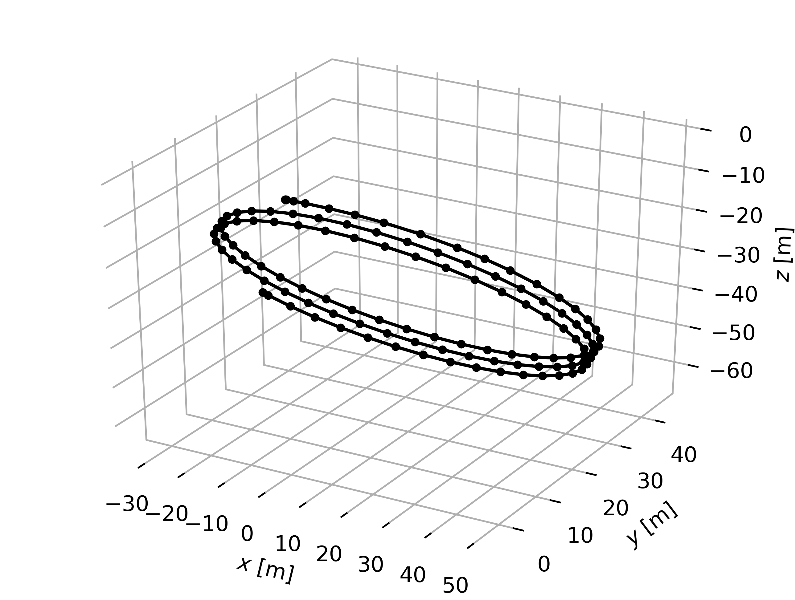

# SAM Dynamics

This is where we put dynamics models for AUVs, following the API of `src/dynamics.py`.

## Example usage

```python
# instantiate Fossen model
system = Fossen()

# define a controller
controller = lambda x: np.array([1000, 1000, 0.1, 0.1])

# initial state
state = np.array([0, 0, 0, 1, 0, 0, 0, 0, 0, 0, 0, 0, 0])

# propagate system from t0=0 to tf=50 [s]
t, x, u = system.propagate(state, controller, 0, 50, atol=1e-4, rtol=1e-4)

# save a plot
system.plot('../img/trajectory.png', x, dpi=500)
```

